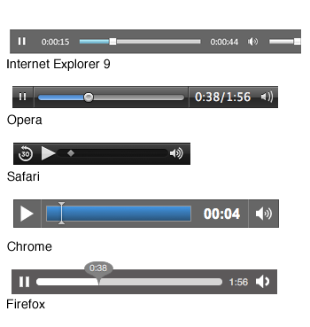
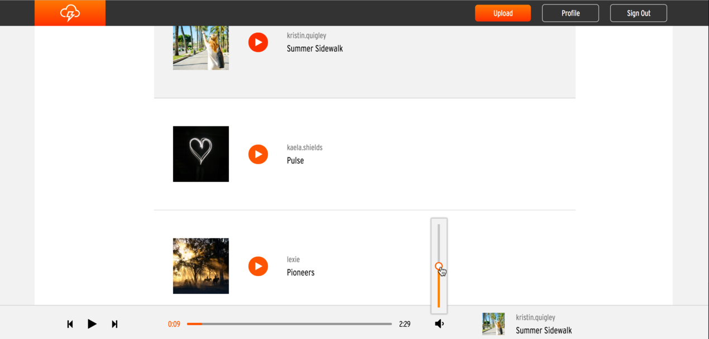

# AudioNimbus
[Live link][heroku]

[heroku]: http://audionimb.us/

AudioNimbus is a music uploading web application inspired by SoundCloud.

## Technical Details
The
application uses a PostgreSQL database, Ruby on Rails back-end, AWS cloud hosting,
and a React.js frontend with a Redux architectural framework.

### Content Management
#### Rails
User profile pictures, track album art, and track audio mp3 files are all stored using AWS S3. This app uses the Paperclip gem to interface between Rails and AWS. This gem

The migration adds ```:image``` and ```:music``` as attachments to the Tracks table. This allows files to be saved like regular columns in the table.
```ruby
add_attachment :tracks, :image
add_attachment :tracks, :music
```

The model validates that there is an attached file, and also validates the type of the attachment so that users can only upload images to the image field and music to the music field.
```ruby
has_attached_file :image, default_url: "assets/track.jpeg"
has_attached_file :music
validates_attachment_content_type :image, content_type: /\Aimage\/.*\Z/
validates_attachment_content_type :music, content_type: [ /\Aaudio\/.*\Z/, 'application/mp3']
```

In the controller, ```:image``` and ```:music``` are handled like any other column.

#### React/Redux

Users upload files via ```<input type="file">``` elements in the front-end. When the uploaded file changes, this triggers an event that saves the new file in the component state using ```FileReader```.


```javascript
changeMusic(e) {
  var reader = new FileReader();
  var file = e.currentTarget.files[0];

  reader.onloadend = function() {
    this.setState({ musicUrl: reader.result, musicFile: file, musicFileName: file.name});
  }.bind(this);

  if (file) {
    reader.readAsDataURL(file);
  } else {
    this.setState({ musicUrl: "", musicFile: null, musicFileName: "Select Song" });
  }
}
```

When the user submits the changes, the file data (saved in the component state in the previous step) gets saved to a ```FormData``` instance. This fires an action previously defined in the component's container. This container action dispatches an API util function. This API util function sends an AJAX query to the Rails server, thus saving the file.

```javascript
// upload_form.jsx
handleSubmit(e) {
  e.preventDefault();

  let formData = new FormData();
  [...]
  formData.append("track[music]", this.state.musicFile)
  this.props.createTrack(formData);
}

// upload_form_container.js
const mapDispatchToProps = (dispatch, ownProps) => {
  return {
    createTrack: (track) => {
      dispatch(createTrack(track));
    }
  };
};

// track_actions.js
export const createTrack = (track) => (dispatch) => {
  return TrackAPIUtil.createTrack(track).then(response => {
    dispatch(receiveTrack(response));
  });
}

// track_api_util.js
createTrack: (formData) => {
  return $.ajax({
    url: "api/tracks",
    type: "POST",
    data: formData,
    processData: false,
    contentType: false,
    dataType: 'json'
  });
}
```


### Track Playback
#### Continuous Play
Navigating around the app does not interrupt playback. All pages within the app are set up to be children of the main App component, which contains the Audio component. This way, the Audio component does not refresh when navigating between pages.


```jsx
// root.jsx
const Root = ({ store }) => {
  return <Provider store={ store }>
    <Router history={ hashHistory }>
      <Route path="/" component={ App } >
        <IndexRoute component={ Home } loggedIn={ !!window.currentUser }  />
        <Route path="home" component={ HomeAfterLogin } onEnter={ _ensureLoggedIn }/>
        [...]
      </Route>
    </Router>
  </Provider>
};

// app.jsx
render() {
  [...]
  return <div>
    { header }
    <div className="body-audio">
      { this.props.children }
      <AudioContainer />
    </div>
    { footer }
  </div>
}
```

#### Custom Controls
HTML handles audio playback through the ```<audio>``` tag. The ```react-audio-player``` package provides a light wrapper around the tag so that the player can be manipulated in React. However, the appearance and functionality of the ```<audio>``` tag are not easily customizable and depend highly on the browser.


To resolve this issue, I created a custom audio component. This custom component interacts with a hidden ```<audio>``` tag's methods and properties. This custom component appears consistent across browsers. All visible elements within this component are custom built.

Hidden audio tag:
```jsx
<ReactAudioPlayer ref={c => this.rap = c } onCanPlay={this.start} className="hidden" src={track.musicUrl}/>
```

Calling ```this.rap``` allows the React component to directly access the ```<audio>``` tag and its properties/methods.

Screenshot:


- Previous and Next buttons
  * The state contains a list of tracks to be played.
  * The current track's position on that list is stored to ```this.props```.
  * The Previous and Next buttons use this to load the correct track.
- Play/Pause button
  * Audio properties/methods used: ```.play()```, ```.pause()```
  * This has to stay in sync with the other play/pause buttons on the site (for example, on the home page).
  * To accomplish this, all play/pause buttons on the website update the store to indicate whether or not the current track is playing.
- Progress bar
  * Audio properties/methods used: ```currentTime```, ```duration```
  * This uses ```rc-progress``` to actually render the progress bar, updating it regularly using ```setInterval()```.
- Volume slider
  * Audio property used: ```volume```
  * This uses ```rc-slider``` to render the volume bar. The slider has an ```onChange``` event that updates the volume.

### Colors
SoundCloud changes the background color of profile pages based on the color of the profile picture. AudioNimbus mimics this functionality using the Miro gem.

After a track image or profile image is saved to AWS, the model calls Miro to get the most dominant colors in the image by RGB value.

```ruby
// track.rb, user.rb
after_save :get_dominant_colors!

// application_record.rb
private
def get_dominant_colors!
  url = self.image.url
  colors = Miro::DominantColors.new(url).to_rgb
  [...]
end
```

The model then finds the dominant colors with the lowest and highest brightnesses, using the formula ```brightness = 0.2126 * red + 0.7152 * green + 0.0722 * blue```. This is saved as an array in the ```:dominant_colors``` column.

```ruby
  self.update_column(:dominant_colors, [colors[max_brightness_index], colors[min_brightness_index]])
```

The React front-end applies a linear gradient background style based on these two dominant colors.

```jsx
// track_details.jsx
let bannerBackground = {
  background: `linear-gradient(135deg, ${this.state.darkestColor} 0%, ${this.state.lightestColor} 100%)`
};

<div className="track-details-banner" style={bannerBackground}>
```

The end result is a background that changes depending on the image's dominant colors.

Examples:


## Future Work
### Waveforms
SoundCloud displays waveforms for the song, which would be a nice visual touch.
### Playlists
Currently, the app simply plays the next track listed on the main page. It would
be nice if users could create playlists and play only the tracks there.
### Likes
Allow users to like tracks.


<!-- [Heroku link][heroku]

[Trello link][trello]


[trello]: https://trello.com/b/auMfS3OH/soundhound

## Minimum Viable Product

AudioNimbus is a web application inspired by SoundCloud built using Ruby on Rails
and React/Redux.  By the end of Week 9, this app will, at a minimum, satisfy the
following criteria with smooth, bug-free navigation, adequate seed data and
sufficient CSS styling:

- [ ] Hosting on Heroku
- [ ] New account creation, login, and guest/demo login
- [ ] Song CRUD
- [ ] Playing songs with progress bar with continuous play
- [ ] Comments
- [ ] User pages
- [ ] Production README

## Design Docs
* [View Wireframes][wireframes]
* [React Components][components]
* [API endpoints][api-endpoints]
* [DB schema][schema]
* [Sample State][sample-state]

[wireframes]: docs/wireframes
[components]: docs/component-hierarchy.md
[sample-state]: docs/sample-state.md
[api-endpoints]: docs/api-endpoints.md
[schema]: docs/schema.md

## Implementation Timeline

### Phase 1: Backend setup and Front End User Authentication (1.5 days)

**Objective:** Functioning rails project with front-end authentication, including a demo login.

### Phase 2: Tracks model, API, and components (2 days)

**Objective:** Allow song CRUD, displaying information about the song as well.

### Phase 3: Cloud setup (1 day)
**Objective:** Set up cloud to host images and audio.

### Phase 4: Track playback (1.5 days)

**Objective:** Tracks play continuously across pages.

### Phase 5: User profile information (1.5 days)

**Objective:** User pages that contain username, email, profile picture, and tracks.

### Phase 6: Comments model, API, and components (1.5 days)

**Objective:** Allow users to comment on tracks.

### Bonus Features (TBD)
- [ ] Wave Forms
- [ ] Playlists
- [ ] Likes -->
